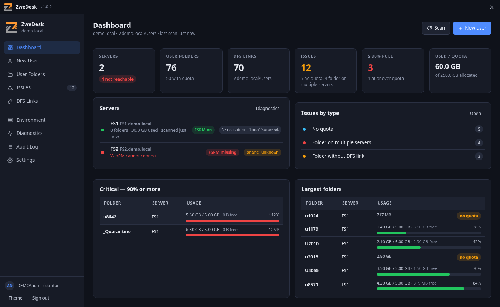
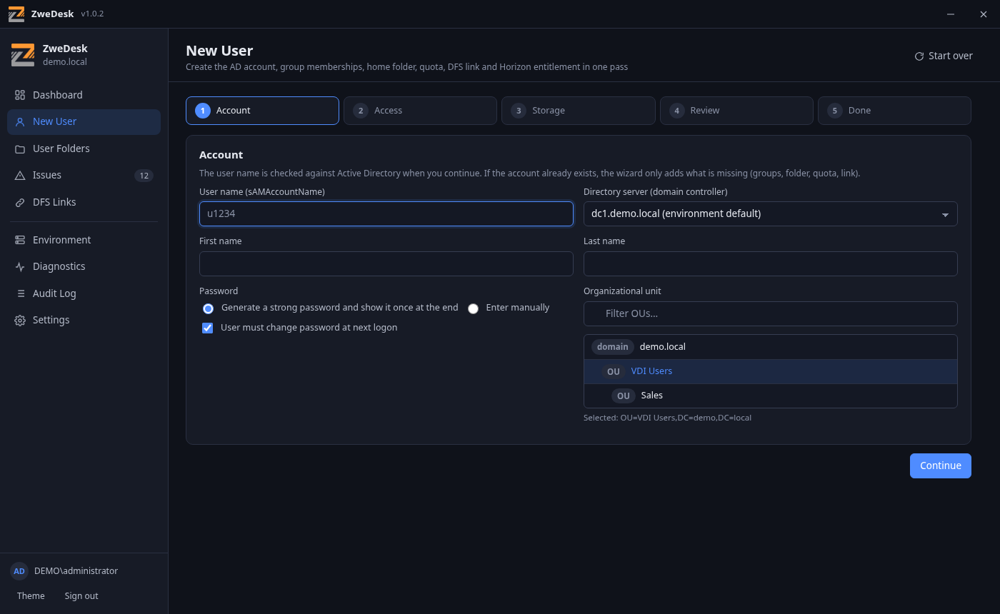
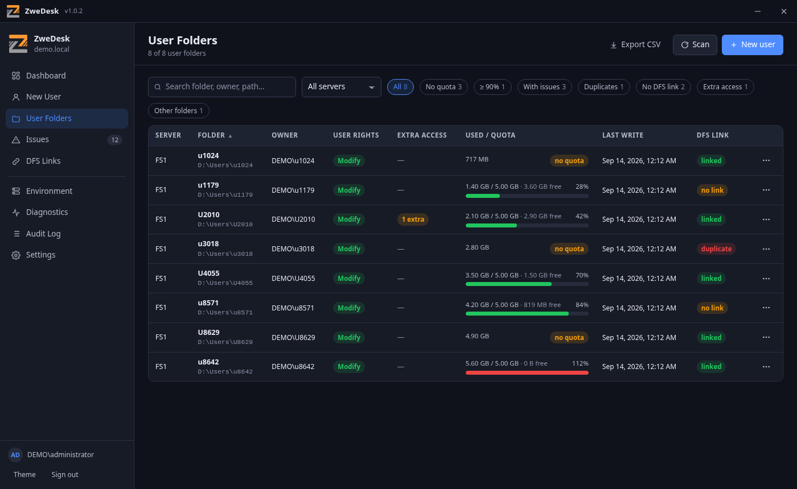
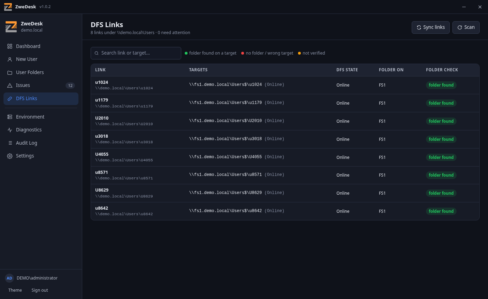
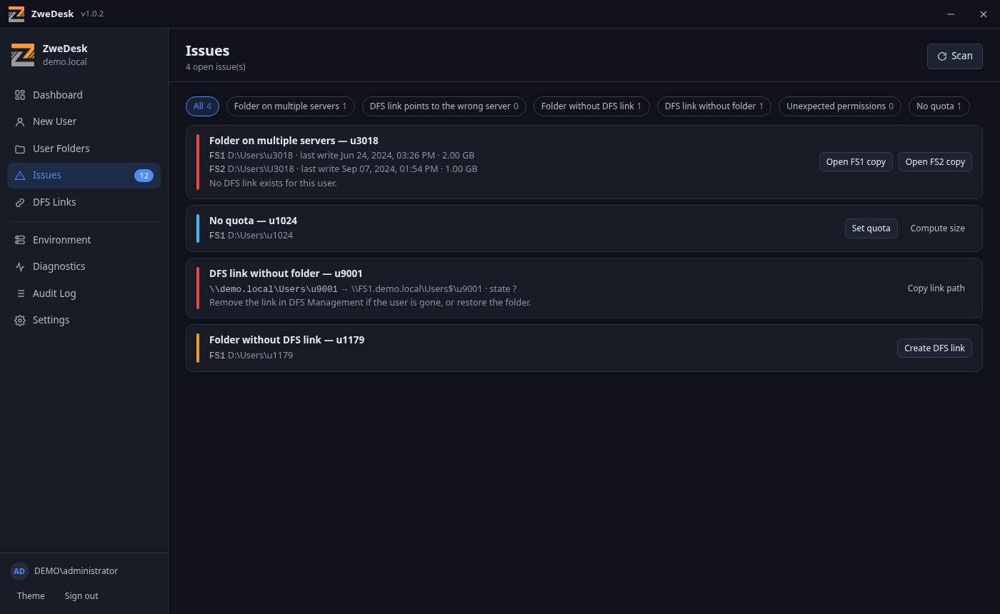
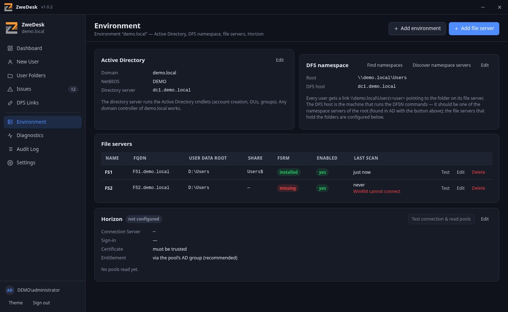
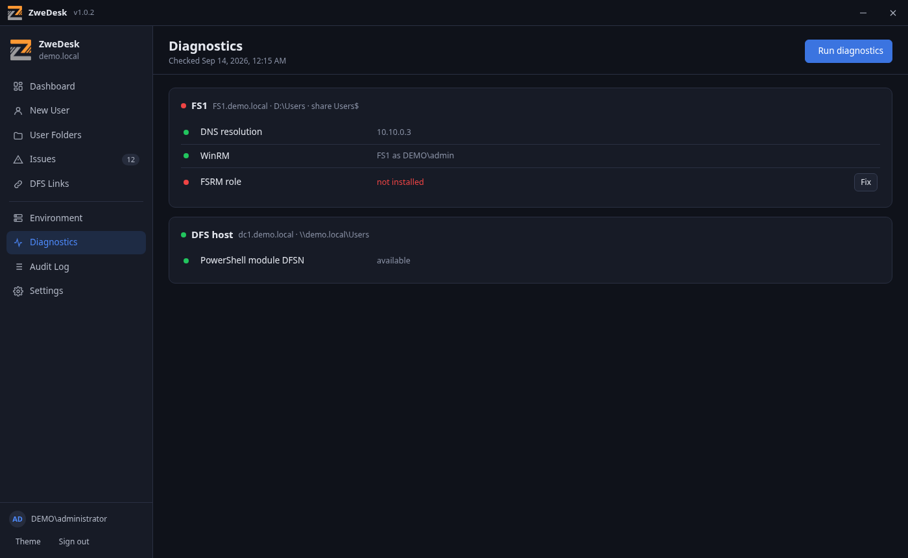

<p align="center">
  
</p>

<h1 align="center">ZweDesk</h1>

<p align="center">
  Provisioning and housekeeping for VDI user estates on Windows domains.<br>
  One wizard creates a user end to end — AD account, groups, home folder, FSRM quota, DFS link, Horizon entitlement —<br>
  and the rest of the tool keeps the estate consistent.
</p>

<p align="center">
  <a href="https://github.com/zweken/ZweDesk/actions/workflows/build.yml"></a>
  <a href="https://github.com/zweken/ZweDesk/releases/latest"></a>
  <a href="LICENSE"></a>
</p>



ZweDesk is a single portable `ZweDesk.exe` (C# / .NET 10, WinForms host, WebView2 interface, embedded SQLite) for the
administrator of a Windows domain whose users get a home folder on a file server, an FSRM quota, a link in a DFS
namespace and — optionally — a VMware Horizon desktop pool. Nothing is installed on the servers: every remote action is
Windows PowerShell executed on the target machine over WinRM with the credential you sign in with.

## What it does

| | |
|---|---|
| **New User wizard** | Account (user name, names, generated or entered password, OU from the live OU tree) → groups from the live group list and a Horizon pool → file server and quota → review against AD, the folders and the namespace → create. A failed step stops the dependent steps; nothing is rolled back; running the wizard again with the same user name continues where it stopped. |
| **Scan** | Every user folder on every file server with owner, ACL, FSRM quota and usage; every link of the DFS namespace with its targets and state. |
| **Issues** | Duplicate folders on several servers, links pointing at the wrong server, folders without a link, links without a folder, ACL entries outside the standard pattern, folders without a quota. |
| **User Folders** | Searchable, sortable table with usage bars, extra-access badges and link status; a details drawer with the full ACL and change history; set or change quota, compute size, create the DFS link, export CSV. |
| **Sync links** | Dry run first (links to create, folders needing a manual decision, links without a folder, wrong targets), then creates only the links you select. Links are never deleted or re-pointed. |
| **Diagnostics** | Per file server: DNS, ICMP, WinRM, local administrator, FSRM role (one-click install), user data root, share mapping. For the DFS host: WinRM, DFSN module (one-click install), namespace reachable. |
| **Environment** | Active Directory (domain, NetBIOS, directory server), DFS namespace (root and host, both discoverable from AD), file servers, Horizon Connection Server. Several environments side by side. |
| **Audit log** | Every sign-in, scan, account creation, group change, quota change, folder / link creation, Horizon entitlement and role installation — actor, target, parameters, result. |

<table>
  <tr>
    <td></td>
    <td></td>
  </tr>
  <tr>
    <td></td>
    <td></td>
  </tr>
  <tr>
    <td></td>
    <td></td>
  </tr>
</table>

Dark and light themes ([light dashboard](docs/screenshots/dashboard-light.png), [sign-in](docs/screenshots/login.png)).

## Download

Grab `ZweDesk.exe` from the [latest release](https://github.com/zweken/ZweDesk/releases/latest) and start it — there
is nothing to install. The full build (~265 MB) carries the .NET runtime, the interface, SQLite and the official Microsoft
WebView2 Runtime installers, so it also runs on a Windows Server that has never seen WebView2 (the runtime is installed
once, system-wide, after a UAC prompt). `ZweDesk-lite.exe` (~50 MB) is the same program without the embedded installers
for machines that already have the WebView2 Runtime.

Requirements on the machine that runs the tool: Windows 10 / Windows Server 2016 or later, x64, joined to the domain,
WinRM reachable on the directory server, the DFS host and the file servers. An administrative workstation or management
server is the right place; a domain controller works but is not recommended.

## First run

1. Start `ZweDesk.exe`. The domain this computer is joined to becomes the environment (read from the local LSA policy —
   no network access). On a workgroup computer the first screen asks for the domain.
2. Sign in with an account that may create users in the chosen OU, manage the groups, is a member of Administrators on
   the file servers and manages the DFS namespace (Domain Admins qualifies). The credential is validated against AD over
   LDAP, the NetBIOS name is corrected, and — when this computer is not a domain controller — the directory server and
   the DFS host are set to the DC that answered. If the domain has exactly one domain-based DFS namespace it becomes
   the DFS root; otherwise choose one under **Environment → Find namespaces**. Every adjustment is shown as a notice.
3. Add the file servers under **Environment** (name, FQDN, local user data root). The share name is discovered by
   Diagnostics.
4. Open **Diagnostics**, fix what is red (FSRM role, DFSN module — one click each), then **Scan**.
5. Use the wizard, the folder table and the link sync.

Try it without any servers: `ZweDesk.exe --mock` runs against a fictional domain `demo.local` with two file servers,
sample OUs, groups and Horizon pools, in its own database.

## Security model

* **Nothing runs on the servers except the PowerShell ZweDesk sends**, and nothing runs locally except the interface.
  AD cmdlets run on the directory server, DFSN cmdlets on the DFS host, FSRM / ACL work on the file servers — all
  through `Invoke-Command` (WinRM, Kerberos) with the credential entered at sign-in. The interactive Windows session is
  never used.
* **Passwords never touch a command line, a file, the audit log or the log.** The sign-in password and a new account's
  password reach the local `powershell.exe` on stdin only; a new account's password travels to the domain controller as a
  `SecureString` inside the encrypted WinRM session and is shown once in the interface.
* **Remembered credentials** (opt-in) and the Horizon administrator password are DPAPI-protected for the current
  Windows account only; copying the database to another machine or account does not carry them.
* **Least surprise on the estate:** the tool creates accounts, group memberships, folders, quotas and links. It never
  deletes anything, never re-points a link, never changes an existing account's password and never touches a folder it
  did not create except to set a quota you asked for.
* The interface is served from an internal virtual host and loads nothing from the network. No context menu except
  cut / copy / paste in text fields, no script dialogs, no error pages, no zoom, no browser shortcuts, no file drops, no
  autofill.
* Only `New-ADUser` and `Add-ADGroupMember` write to Active Directory ([`src/Remote/PsScripts.cs`](src/Remote/PsScripts.cs)
  is the complete list of remote scripts).

See [SECURITY.md](SECURITY.md) for reporting vulnerabilities.

## Requirements on the servers

* **Directory server** — any domain controller of the environment (runs `New-ADUser`, `Get-ADOrganizationalUnit`,
  `Add-ADGroupMember` … through WinRM; the ActiveDirectory module is always present on a DC).
* **File servers** — WinRM enabled (default on Windows Server), the FSRM role (`FS-Resource-Manager`; Diagnostics
  installs it on request) and an SMB share that exports the user data root (Diagnostics discovers its name).
* **DFS host** — one of the namespace servers of the root (a DC for namespaces hosted on DCs, or the file servers when
  they host the namespace); ZweDesk reads them from AD. It needs the `DFSN` PowerShell module (Diagnostics installs
  `RSAT-DFS-Mgmt-Con` on request). The file servers that hold the folders are a separate list and may be the same or
  different machines.
* **Horizon** (optional) — the Connection Server REST API (Horizon 8 / 2006 or later) over HTTPS; the sign-in account or
  a dedicated administrator needs a Horizon administrator role. Self-signed certificates can be accepted per environment.

## Command line

| Switch | Effect |
|---|---|
| `--mock` | Demo mode: no network access, fictional data, own database `zwedesk-mock.db`. |
| `--db <path>` | Use another database file. |
| `--debug` | DevTools, full context menu and browser shortcuts in the interface; the file-based script hook `debug-eval.js` for test automation. |
| `--selftest` | Runs every remote PowerShell script through the WinRM wrapper against `localhost` with a dummy credential and writes `selftest.txt`; exit code 0 means no script has a syntax error. |

Data lives in `%LocalAppData%\ZweDesk\`: `zwedesk.db` (environments, scan results, audit), `logs\zwedesk-YYYYMMDD.log`,
`WebView2\` (browser profile), `ui\<version>\` (extracted interface). Copying `zwedesk.db` to another machine moves the
configuration. Window size, position and theme are remembered.

## Troubleshooting

The reason a server is unreachable stays visible on the Dashboard and under Environment, together with the usual remedy:

| Message contains | Cause / remedy |
|---|---|
| `WinRM cannot complete the operation`, `cannot connect to the destination` | WinRM is not enabled on the server or TCP 5985 is blocked. On the server: `Enable-PSRemoting -Force`. |
| `TrustedHosts`, `not joined to a domain` | This computer is not a member of the domain (or the server is addressed without its FQDN). Run ZweDesk on a domain-joined computer. |
| `Kerberos` | Use the FQDN registered in DNS; this computer and the server must be members of the same (or a trusted) domain. |
| `Access is denied` | The account is not a member of Administrators on that server. |
| `server name cannot be resolved` | DNS — check the FQDN under Environment. |

Link checks are only made against file servers that were scanned successfully; links pointing at a server that could not
be scanned show **not verified** rather than a false "no folder".

## Building from source

```powershell
.\build.ps1
```

Output: `dist\ZweDesk.exe`. The script finds a .NET 10 SDK (or installs one in user scope), downloads the official
WebView2 Runtime installers into `prereq\cache\` (Authenticode-verified, kept for the next build) and publishes a single
self-contained file. Options: `-NoEmbeddedRuntime` (the ~50 MB build), `-Configuration Debug`, `-SkipPublish`,
`-NoSdkInstall`. The interface (`ui/`) is plain HTML / CSS / JavaScript with no build step and no external resources;
opening `ui/index.html` in a browser shows it with preview data.

```
ZweDesk.csproj   build.ps1
src/App          Program.cs, MainForm.cs (frameless host window), PrereqForm.cs (WebView2 installer), Bridge.cs (JSON-RPC over WebView2)
src/Core         AppService.cs (use cases incl. provisioning), Db.cs (SQLite + migrations), IssueEngine.cs, Models.cs, MachineDomain.cs
src/Remote       WinRmRunner.cs (powershell.exe + Invoke-Command), PsScripts.cs (every remote script)
src/Providers    RealProvider.cs (LDAP + WinRM), HorizonClient.cs (REST), MockProvider.cs (demo data)
prereq/          carrier assembly that embeds the WebView2 installers (build input, not committed)
ui/              index.html, app.css, app.js, wizard.js, logo.png
fixtures/        synthetic folder listing for the demo mode
```

## Contributing

Issues and pull requests are welcome — see [CONTRIBUTING.md](CONTRIBUTING.md). Keep in mind that the tool runs with
domain-administrator credentials: changes to the remote scripts or the credential path get extra scrutiny.

## License

Apache License 2.0 — see [LICENSE](LICENSE). Third-party components and their licenses are listed in
[THIRD-PARTY-NOTICES.md](THIRD-PARTY-NOTICES.md).

ZweDesk and the Z logo are trademarks of Zweken. The Apache license covers the code, not the name and the logo: forks
should use their own.
